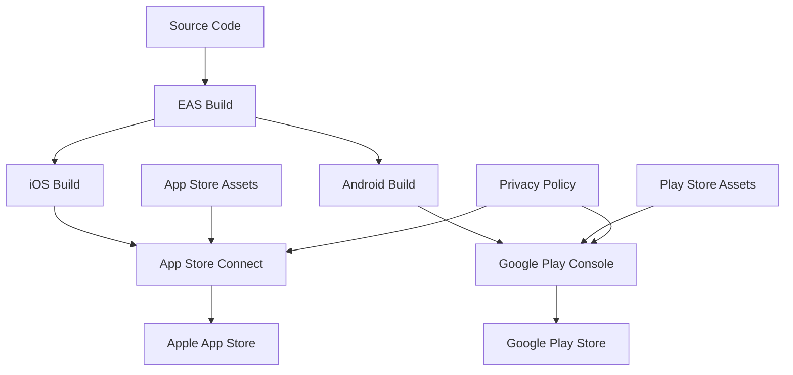

# Design Document

## Overview

Dit design document beschrijft de architectuur en implementatie voor het deployen van de Wedding Planner Checklist app naar de Apple App Store en Google Play Store. De app is gebouwd met Expo/React Native en heeft al een solide basis met EAS (Expo Application Services) configuratie.

## Architecture

### Current State Analysis

- **Platform**: Expo SDK 53 met React Native 0.79.2
- **Build System**: EAS Build geconfigureerd met development, preview en production builds
- **App Configuration**: Basis app.json met iOS en Android configuraties
- **Assets**: Bestaande app icons en splash screens
- **Bundle Identifiers**:
  - iOS: `com.superabraham.weddingplannerchecklist`
  - Android: `com.superabraham.weddingplannerchecklist`

### Deployment Architecture



## Components and Interfaces

### 1. App Store Metadata Configuration

- **App Name**: "Wedding Planner Checklist" (mogelijk lokalisatie naar "Bruiloft Checklist")
- **Description**: Nederlandse en Engelse beschrijvingen
- **Keywords**: Bruiloft, wedding, planner, checklist, organisatie
- **Category**: Lifestyle/Productivity
- **Age Rating**: 4+ (geen gevoelige content)

### 2. Visual Assets Requirements

#### iOS App Store Assets

- **App Icon**: 1024x1024px (al aanwezig als icon.png)
- **Screenshots**:
  - iPhone 6.7": 1290x2796px (3 screenshots minimum)
  - iPhone 6.5": 1242x2688px
  - iPad Pro 12.9": 2048x2732px (optioneel)
- **App Preview Video**: Optioneel, 30 seconden max

#### Google Play Store Assets

- **App Icon**: 512x512px (aanpassen van bestaande icon)
- **Feature Graphic**: 1024x500px
- **Screenshots**:
  - Phone: 1080x1920px minimum (2-8 screenshots)
  - Tablet: 1200x1920px (optioneel)
- **Promo Video**: Optioneel, YouTube link

### 3. Privacy and Compliance Components (Simplified for MVP)

#### App Store Privacy Labels

- **iOS**: App Privacy sectie in App Store Connect - "No data collected"
- **Android**: Data Safety sectie in Play Console - "No data shared with third parties"
- **Data Types**: Alleen lokale opslag, geen data verzameling of delen
- **Data Types**: Geen persoonlijke data verzameling (alleen lokale opslag)

### 4. Build Configuration Enhancement

#### EAS Build Profiles

```json
{
  "build": {
    "production": {
      "autoIncrement": true,
      "env": {
        "EXPO_PUBLIC_APP_VARIANT": "production"
      }
    }
  }
}
```

#### App.json Enhancements

- **Version Management**: Automatische versie incrementing
- **Permissions**: Minimale permissions voor beide platforms
- **Orientation**: Portrait lock voor consistente UX
- **Splash Screen**: Geoptimaliseerd voor beide platforms

## Data Models

### App Store Listing Data

```typescript
interface AppStoreListing {
  name: string;
  subtitle?: string; // iOS only
  description: string;
  keywords: string[];
  category: AppCategory;
  screenshots: Screenshot[];
  privacyPolicyUrl: string;
  supportUrl: string;
}

interface Screenshot {
  deviceType: "iphone" | "ipad" | "android";
  size: string;
  filePath: string;
}
```

### Build Configuration

```typescript
interface BuildConfig {
  platform: "ios" | "android";
  buildType: "development" | "preview" | "production";
  version: string;
  buildNumber: number;
  bundleIdentifier: string;
}
```

## Error Handling

### Build Failures

- **Dependency Issues**: Automated dependency checking
- **Certificate Problems**: Clear error messages en recovery steps
- **Asset Validation**: Pre-build asset validation
- **Size Limits**: Bundle size monitoring en optimization

### Store Rejection Scenarios

- **Metadata Issues**: Validation checklist voor submissions
- **Privacy Policy**: Automated compliance checking
- **App Functionality**: Testing protocol voor store requirements
- **Asset Quality**: Automated asset quality validation

### Recovery Strategies

- **Rollback Mechanism**: Previous version restoration capability
- **Hotfix Process**: Critical bug fix deployment process
- **Communication Plan**: User notification voor belangrijke updates

## Testing Strategy

### Pre-Submission Testing

1. **Functional Testing**

   - Alle app features werken correct
   - Geen crashes op verschillende devices
   - Performance testing op oudere devices
   - Memory usage optimization

2. **Store Compliance Testing**

   - App Store Review Guidelines compliance
   - Google Play Policy compliance
   - Metadata consistency

3. **Device Testing Matrix**
   - iOS: iPhone SE, iPhone 14, iPhone 15 Pro, iPad
   - Android: Various screen sizes en Android versions
   - Performance op low-end devices

### Automated Testing

```typescript
// Example test structure
describe("App Store Readiness", () => {
  test("App launches without crashes", () => {});
  test("All navigation works correctly", () => {});
  test("Data persistence works", () => {});
  test("No console errors in production build", () => {});
});
```

### Manual Testing Checklist

- [ ] App icon displays correctly in alle contexts
- [ ] Splash screen shows properly
- [ ] All features accessible zonder crashes
- [ ] Text is readable op alle screen sizes
- [ ] Navigation flows work intuïtively
- [ ] Data saves en loads correctly
- [ ] App works offline (geen network dependencies)

## Implementation Phases

### Phase 1: Asset Preparation

- Screenshot generation voor beide platforms
- App icon optimization
- Feature graphic creation voor Google Play

### Phase 2: Store Setup

- Apple Developer Account setup
- Google Play Developer Account setup
- App Store Connect app creation
- Google Play Console app creation

### Phase 3: Build Optimization

- Production build configuration
- Bundle size optimization
- Performance improvements
- Final testing

### Phase 4: Store Submission

- Metadata upload
- Asset upload
- Build upload via EAS Submit
- Review submission

### Phase 5: Post-Launch

- Monitor reviews en ratings
- Analytics setup
- Update process establishment
- User feedback integration

## Security Considerations

### Code Signing

- **iOS**: Apple Developer certificates via EAS
- **Android**: Upload key management via EAS
- **Key Security**: Secure key storage en rotation

### Privacy Protection

- **Local Data Only**: Geen cloud data storage
- **Minimal Permissions**: Alleen benodigde permissions
- **No Data Collection**: App verzamelt geen persoonlijke data

### App Security

- **Code Obfuscation**: Production build optimization
- **API Security**: Geen externe API calls (lokale app)
- **Data Validation**: Input sanitization voor user data

## Performance Optimization

### Bundle Size Optimization

- **Tree Shaking**: Unused code elimination
- **Asset Optimization**: Image compression en format optimization
- **Dependency Audit**: Remove unused dependencies

### Runtime Performance

- **Memory Management**: Efficient state management
- **Rendering Optimization**: FlatList optimization voor grote lijsten
- **Storage Performance**: AsyncStorage optimization

### Loading Performance

- **Splash Screen**: Optimized loading experience
- **Code Splitting**: Lazy loading waar mogelijk
- **Asset Preloading**: Critical assets preloading
